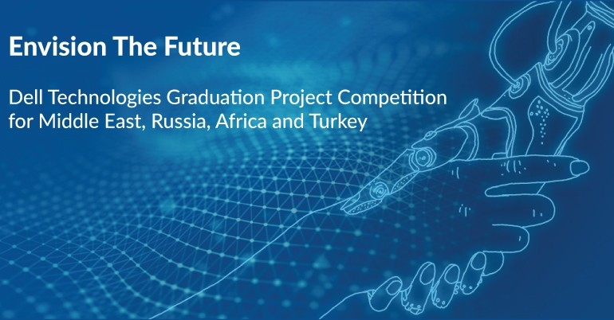

# 🚀 AOAI - Dell Envision the Future by KAAS Club
 
AOAI (Academic Orientation using Artificial Intelligence) is a project that we developed as part of our participation in the ["Envision the Future" competition](https://emcenvisionthefuture.com/) organized by Dell EMC. We are proud to have reached the final stage among 100 projects, representing our university [ENSAM Casablanca](http://ensam-casa.ma/) through our club called [KAAS (Knowledge As A Service)](https://github.com/Daeels/KAAS_Club)

## 📂 Repository Contents

### 🔍 AI Model

We have developed an AI model that powers AOAI. You can find the code for this model in our dedicated repository .

🔗 [AI Model Repository](https://github.com/Daeels/AOAI-Dell-Envision-the-Future-by-KAAS-Club/tree/main/AOAI-Model)

🔗 [AI Training Repository](https://github.com/Daeels/AOAI-Dell-Envision-the-Future-by-KAAS-Club/tree/main/AOAI-Training)

### 💻 Back-end and Front-end

We have developed the back-end and front-end of AOAI using Javascript (Node, Express and React). You can find the code for these components in our dedicated repositories.

- 🔗 [Back-end Repository (Azure free ended, backend disabled) ](https://github.com/Daeels/AOAI-Dell-Envision-the-Future-by-KAAS-Club/tree/main/AOAI_Backend_With_Docker)
- 🔗 [Front-end Repository](https://github.com/Daeels/AOAI-Dell-Envision-the-Future-by-KAAS-Club/tree/main/AOAI_Frontend)

### 📋 Reports

We have submitted two reports as part of our participation in the "Envision the Future" competition. You can find these reports below.

- 📄 [First Report](https://github.com/Daeels/AOAI-Dell-Envision-the-Future-by-KAAS-Club/blob/main/First%20Report.pdf)
- 📄 [Interim Report](https://github.com/Daeels/AOAI-Dell-Envision-the-Future-by-KAAS-Club/blob/main/Interim%20Report.pdf)

### 🎥 Video Presentation

Watch our video presentation to learn more about our project. Link below.

🔗[AOAI - Artificial Orientation using Artificial Intelligence](https://www.youtube.com/watch?v=oytv-_WaQ8A&ab_channel=TarikAmri)

## 🌐 Website

Visit our website to see the live demo of AOAI and learn more about our project.

🔗 [AOAI Website (Azure free ended, backend disabled)](https://int-aoai.netlify.app/)

https://user-images.githubusercontent.com/55410084/232162793-4e22e622-afd4-45a1-80a1-ffdbb396e3ab.mp4

### 📷 Poster

We have created a poster to promote AOAI during the final stage of the "Envision the Future" competition. You can find this poster below.

### 📰 University Publication

Our university ENSAM Casablanca has published an article on its official website to celebrate our achievement in the "Envision the Future" competition. You can find this publication below.

## 📞 Contact Us

Feel free to contact us if you have any questions or feedback regarding our project.

- 📧 Email: [ilyasirgui@gmail.com](mailto:ilyasirgui@gmail.com)
- 📘 Facebook: [KAAS Club](https://web.facebook.com/KAASENSAM/)

## 🏆 Acknowledgments

We would like to thank Dell EMC for organizing this competition and providing us with the opportunity to showcase our skills and knowledge. We would also like to thank our university ENSAM Casablanca for their support and our club KAAS (Knowledge As A Service) for their collaboration and hard work.

## 📝 License

This project is licensed under the [MIT License](https://opensource.org/licenses/MIT). Feel free to use and modify this project as per the license terms.

